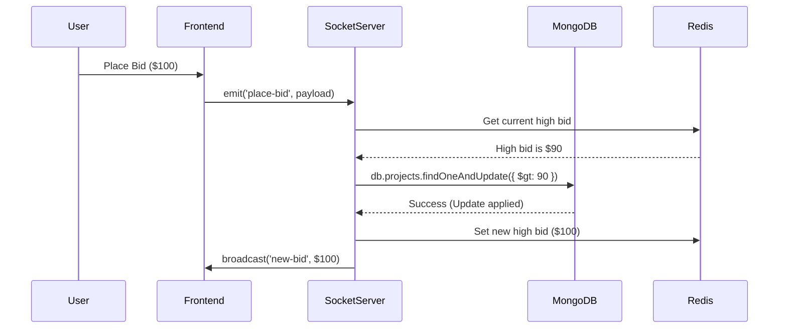

# Architecture Research: Bidlance Marketplace

## Component Boundaries

The system is split into distinct services to handle high-concurrency bidding.

1.  **Frontend (Next.js)**: Server-side rendering for SEO; Client-side logic for real-time bidding updates.
2.  **API Gateway (Express/NestJS)**: Entry point for web traffic; handles routing and standard CRUD.
3.  **Real-time Engine (Socket.IO)**: Specialized server layer for websocket connections.
4.  **Job Processor (BullMQ/Redis)**: Handles asynchronous tasks (emails, payment webhooks, timer expirations).

## Data Flow (Live Bidding)

## Suggested Build Order

1.  **Phase 1: Core Foundation**: Auth, User Profiles, Wallet Schema.
2.  **Phase 2: Project System**: CRUD for projects, fixed-price purchases.
3.  **Phase 3: Escrow & Payments**: Integration with Stripe/Local gateways, holding funds.
4.  **Phase 4: Live Bidding**: WebSockets, Bidding rooms, Timers.
5.  **Phase 5: Trust & Polish**: Disputes, Reviews, Final UI polish.

## Scalability Notes
- **Horizontal Scaling**: Use the `Redis Adapter` for Socket.IO.
- **Sticky Sessions**: Required if scaling across multiple server instances.
